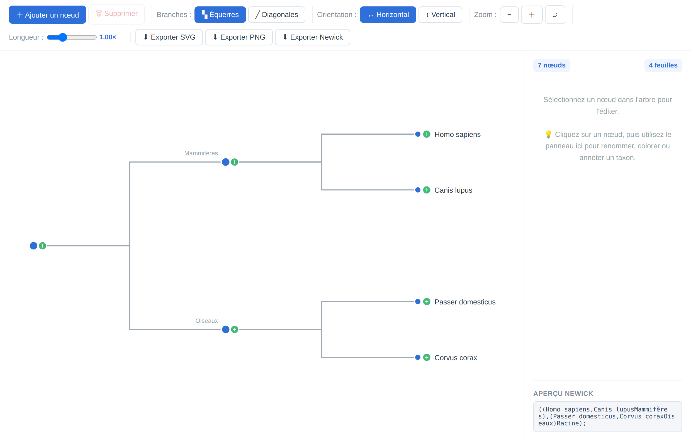
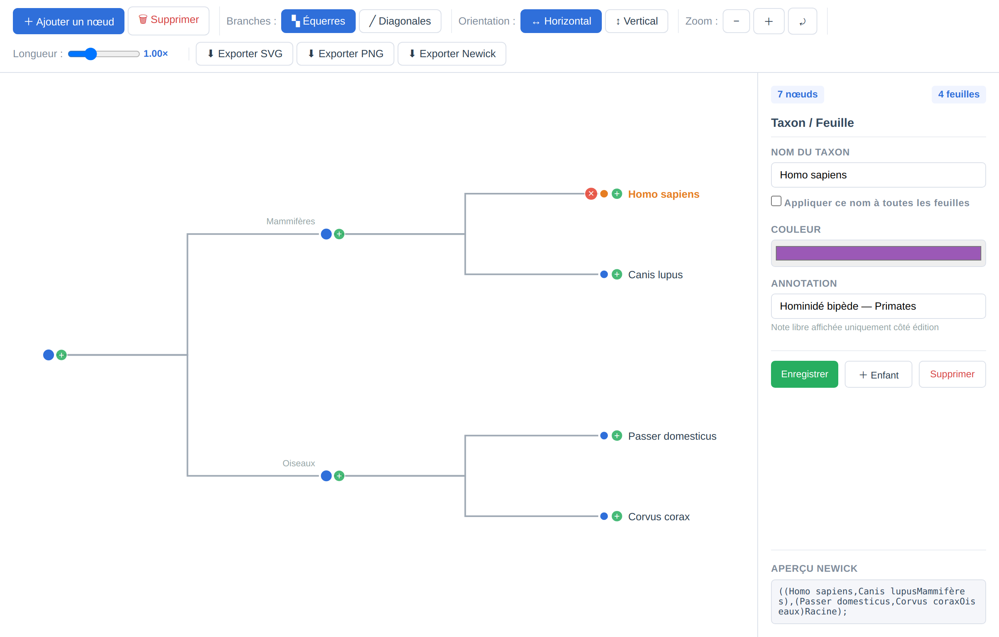
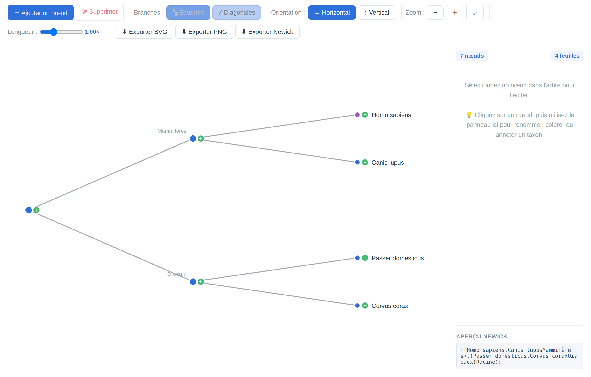
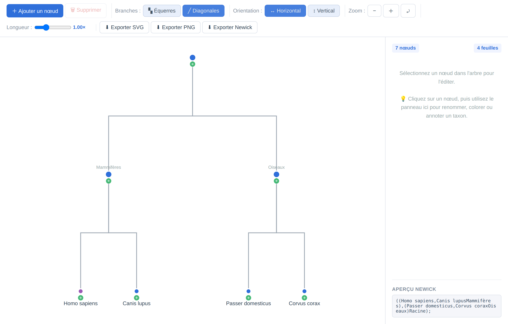

# Shinka (進化)

Éditeur d'arbres phylogénétiques pour la biologie.



## Description

**Shinka** (進化, "évolution" en japonais) est une application Electron/React permettant de créer, éditer et visualiser des arbres phylogénétiques. Outil conçu pour les biologistes, étudiants et chercheurs en systématique.

## Captures d'écran

### Vue générale de l'éditeur
Interface principale avec barre d'outils complète, visualisation D3.js en temps réel, panneau latéral d'inspection et aperçu Newick instantané.


### Édition d'un taxon et métadonnées
Sélection interactive d'un nœud ou d'une feuille pour personnaliser le nom de l'espèce ou du clade, assigner une couleur thématique, ajouter des annotations scientifiques et manipuler la descendance.



### Styles de branches et orientations

| Branches en diagonales | Orientation verticale |
| :---: | :---: |
|  |  |

## Fonctionnalités

- **Éditeur interactif** — Créez et modifiez votre arbre en direct
- **Nœuds éditables** — Renommez les taxons, modifiez les branches, attribuez des couleurs et annotations
- **Styles de branches** — Rectangulaire (équerres) ou diagonale
- **Orientation** — Horizontale ou verticale
- **Export multi-formats** — PNG, SVG, Newick
- **Zoom & navigation** — Zoom avant/arrière, recentrage
- **Statistiques** — Nombre de nœuds et feuilles calculé en temps réel

## Installation

```bash
git clone https://github.com/ton-username/shinka.git
cd shinka
npm install
```

## Utilisation

```bash
# Mode développement
npm run dev

# Build production
npm run build

# Package distribuable (Linux .deb)
npm run dist
```

## Stack technique

- **Frontend** — React 18, D3.js
- **Desktop** — Electron
- **Bundler** — Webpack
- **Export** — html-to-image

## Formats d'export

| Format | Usage |
|--------|-------|
| `.png` | Image haute résolution (2x) |
| `.svg` | Vectoriel, idéal pour publications |
| `.newick` | Format standard bioinformatique |

## Licence

MIT